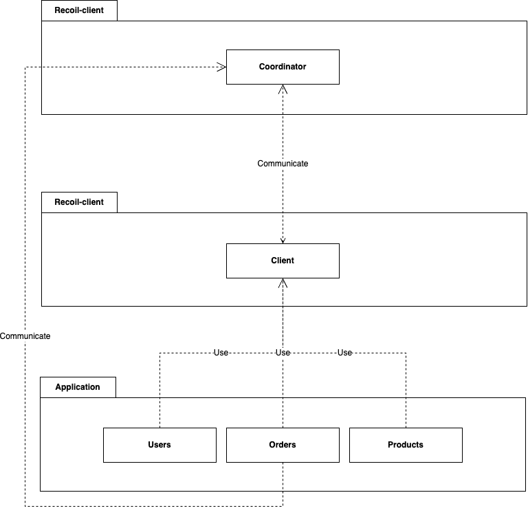

# Recoil

Recoil will be a Seata-like build with rust, providing a robust and scalable solution for distributed transactions.

## Architecture

the architecture is composed of two parts:
- Coordinator
- Client-lib

Stack technique:

Coordinator -	actix-web, tonic (gRPC), tokio, sled ou postgres
Client-lib - Crate interne ou publique, macros (proc_macro), sqlx ou sea-orm
Undo log - Middleware SQL wrapper + tables undo_log, encodage JSON ou bin
Communication	- gRPC (tonic) ou REST (hyper, reqwest), JSON-RPC possible

